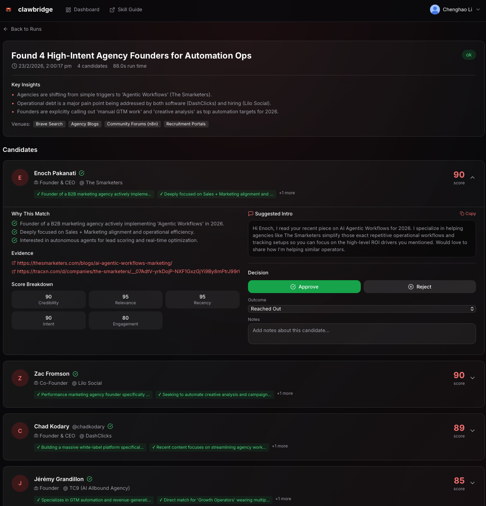

# clawbridge-runner

CLI runner for the clawbridge-skill-latest skill. Executes nightly and delivers Connection Briefs to your preferred channel.

## Features

- **Scheduled Runs** - Cron-based scheduling for nightly execution
- **Multi-Channel Delivery** - Discord, Slack, and Email support
- **Vault Integration** - Optional upload to clawbridge.cloud vault
- **Local Storage** - JSON and Markdown outputs saved locally
- **Dry Run Mode** - Test without actual execution

## Screenshots

### Installer / onboarding


### CLI run output



## Installation

### From npm

```bash
npm install -g clawbridge-runner
```

### From source

```bash
git clone https://github.com/LeeTheBuilder/ClawBridge.git
cd clawbridge-runner
npm install
npm run build
npm link
```

## Quick Start

### 1. Initialize Configuration

```bash
clawbridge init
```

This creates:
- `config.yml` - Your project profile and settings
- `.env` - Environment variables for secrets

### 2. Configure Your Profile

Edit `config.yml`:

```yaml
workspace_id: "ws_your_workspace_id"

project_profile:
  offer: "What your company offers"
  ask: "What you're looking for"
  ideal_persona: "Your target persona"
  verticals:
    - "keyword1"
    - "keyword2"
  tone: "friendly, professional"

delivery:
  target: "discord"  # or "slack" or "email"
  discord:
    channel_id: "YOUR_CHANNEL_ID"
```

### 3. Set Secrets

Edit `.env`:

```bash
DISCORD_WEBHOOK_URL=https://discord.com/api/webhooks/...
# or
DISCORD_BOT_TOKEN=your_bot_token
```

### 4. Test Run

```bash
clawbridge run --dry-run
```

### 5. Schedule Nightly Runs

```bash
clawbridge schedule --cron "0 21 * * *"
```

## Commands

### `clawbridge run`

Execute the skill once.

```bash
clawbridge run [options]

Options:
  -c, --config <path>   Path to config file (default: ./config.yml)
  -o, --output <dir>    Output directory (default: ./output)
  --no-deliver          Skip delivery to Discord/Slack/Email
  --no-upload           Skip vault upload
  --dry-run             Preview without executing
```

### `clawbridge schedule`

Start the scheduler for periodic runs.

```bash
clawbridge schedule [options]

Options:
  -c, --config <path>     Path to config file (default: ./config.yml)
  --cron <expression>     Cron expression (default: "0 21 * * *")
```

Common cron expressions:
- `0 21 * * *` - Every day at 9 PM
- `0 6 * * *` - Every day at 6 AM
- `0 21 * * 1-5` - Weekdays at 9 PM
- `0 9 * * 1` - Every Monday at 9 AM

### `clawbridge init`

Initialize a new configuration.

```bash
clawbridge init [options]

Options:
  -d, --dir <path>    Directory to initialize (default: .)
```

### `clawbridge validate`

Validate your configuration file.

```bash
clawbridge validate -c ./config.yml
```

### `clawbridge test-delivery`

Test your delivery configuration.

```bash
clawbridge test-delivery --channel discord
```

## Configuration

### Full Configuration Reference

```yaml
# Required: Your workspace ID from clawbridge.cloud
workspace_id: "ws_your_workspace_id"

# Required: Project profile
project_profile:
  offer: "What your company/agency offers"
  ask: "What you're looking for (partners, clients, etc.)"
  ideal_persona: "Description of target personas"
  verticals:
    - "B2B SaaS"
    - "marketing automation"
  geo_timezone: "US/Pacific"  # Optional
  disallowed:  # Optional: do-not-contact list
    - "competitor@example.com"
  tone: "friendly, professional"

# Optional: Search constraints
constraints:
  no_spam_rules:
    - "No cold outreach to competitors"
  regions:
    - "US"
    - "EU"
  avoid_list:
    - "@spam_account"

# Optional: Limit resource usage
run_budget:
  max_searches: 20
  max_fetches: 50
  max_minutes: 10

# Required: Delivery configuration
delivery:
  target: "discord"  # or "slack" or "email"
  
  # Discord options
  discord:
    webhook_url: ""  # Prefer: set via DISCORD_WEBHOOK_URL env var
    # OR
    bot_token: ""    # Set via DISCORD_BOT_TOKEN env var
    channel_id: "YOUR_CHANNEL_ID"
  
  # Slack options
  slack:
    webhook_url: ""  # Prefer: set via SLACK_WEBHOOK_URL env var
    # OR
    bot_token: ""    # Set via SLACK_BOT_TOKEN env var
    channel: "#your-channel"
  
  # Email options
  email:
    smtp_host: "smtp.gmail.com"
    smtp_port: 587
    smtp_user: "your@email.com"
    smtp_pass: ""  # Set via SMTP_PASSWORD env var
    from: "Clawbridge <noreply@yourdomain.com>"
    to:
      - "recipient@example.com"

# Optional: Vault integration
vault:
  enabled: false
  api_url: "https://clawbridge.cloud/api"

# Optional: Output settings
output:
  dir: "./output"
  keep_runs: 30  # Keep last N runs
```

### Environment Variables

| Variable | Purpose |
|----------|---------|
| `CLAWBRIDGE_WORKSPACE_TOKEN` | Auth token for vault uploads |
| `DISCORD_WEBHOOK_URL` | Discord webhook URL |
| `DISCORD_BOT_TOKEN` | Discord bot token |
| `SLACK_WEBHOOK_URL` | Slack webhook URL |
| `SLACK_BOT_TOKEN` | Slack bot token |
| `SMTP_PASSWORD` | SMTP password for email |
| `LOG_LEVEL` | Logging level (debug, info, warn, error) |

## Output

### File Structure

```
output/
├── run-2026-02-01T21-00-00.json    # Full JSON output
├── run-2026-02-01T21-00-00.md      # Human-readable report
├── latest.json -> run-2026-02-01T21-00-00.json
└── latest.md -> run-2026-02-01T21-00-00.md
```

### JSON Schema

See the [connection_brief.json](../clawbridge-skill/schema/connection_brief.json) schema in the skill repo.

## Delivery Channels

### Discord

1. **Webhook (Recommended)**
   - Create a webhook in your Discord channel settings
   - Set `DISCORD_WEBHOOK_URL` environment variable

2. **Bot**
   - Create a Discord application and bot
   - Invite bot to your server with `Send Messages` permission
   - Set `DISCORD_BOT_TOKEN` and `channel_id`

### Slack

1. **Webhook (Recommended)**
   - Create an incoming webhook in Slack App settings
   - Set `SLACK_WEBHOOK_URL` environment variable

2. **Bot**
   - Create a Slack app with `chat:write` scope
   - Install to workspace
   - Set `SLACK_BOT_TOKEN` and `channel`

### Email

Configure SMTP settings in your config:

```yaml
delivery:
  target: "email"
  email:
    smtp_host: "smtp.gmail.com"
    smtp_port: 587
    smtp_user: "your@gmail.com"
    from: "Clawbridge <your@gmail.com>"
    to:
      - "team@example.com"
```

For Gmail, use an App Password (not your regular password).

## Running as a Service

### Using systemd (Linux)

Create `/etc/systemd/system/clawbridge.service`:

```ini
[Unit]
Description=Clawbridge Runner
After=network.target

[Service]
Type=simple
User=your-user
WorkingDirectory=/path/to/clawbridge
ExecStart=/usr/bin/node /path/to/clawbridge-runner/dist/index.js schedule
Restart=always
RestartSec=10
EnvironmentFile=/path/to/clawbridge/.env

[Install]
WantedBy=multi-user.target
```

```bash
sudo systemctl enable clawbridge
sudo systemctl start clawbridge
```

### Using PM2

```bash
npm install -g pm2
pm2 start "clawbridge schedule" --name clawbridge
pm2 save
pm2 startup
```

### Using Docker

```dockerfile
FROM node:20-alpine
WORKDIR /app
COPY . .
RUN npm install && npm run build
CMD ["node", "dist/index.js", "schedule"]
```

## Development

```bash
# Install dependencies
npm install

# Run in development
npm run dev -- run --dry-run

# Build
npm run build

# Run tests
npm test

# Lint
npm run lint
```

## Related Projects

- **clawbridge-skill** - The OpenClaw skill for discovery
- **clawbridge-web** - Web UI for workspace management

## License

MIT License - see LICENSE for details.
